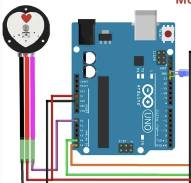

# Biometric monitor and display 
For this project, I created a biometric heart rate monitor using an Arduino Uno and a pulse sensor that uses green light to detect how quickly it reflects off my skin—this is how it senses each heartbeat. The Arduino uses my computer power to  power  the sensor and also sends data to my computer,  where I can see my heartbeats per minute in real time. One of my biggest challenges was getting the code to work properly, but through trial and error, I learned the importance of double-checking cable connections and understanding how each component interacts. Seeing the  heartbeat appear on screen was a huge triumph and made the challenges  worth it.

Main challenge: coding!!

You should comment out all portions of your portfolio that you have not completed yet, as well as any instructions:
```HTML 
<!--- This is an HTML comment in Markdown -->
<!--- Anything between these symbols will not render on the published site -->
```

| **Name** | **School** | **Area of Interest** | **grade** |
|:--:|:--:|:--:|:--:|
| Leandra R| Kipp college prep | Electrical Engineering | Incoming sophomore 

**Replace the BlueStamp logo below with an image of yourself and your completed project. Follow the guide [here](https://tomcam.github.io/least-github-pages/adding-images-github-pages-site.html) if you need help.**


  
# Final Milestone

**Don't forget to replace the text below with the embedding for your milestone video. Go to Youtube, click Share -> Embed, and copy and paste the code to replace what's below.**


For your final milestone, explain the outcome of your project. Key details to include are:
- What you've accomplished since your previous milestone
- What your biggest challenges and triumphs were at BSE
- A summary of key topics you learned about
- What you hope to learn in the future after everything you've learned at BSE


 <iframe width="502" height="893" src="https://www.youtube.com/embed/V3dbaUgp3Kw" title="Leandra R. Milestone 1" frameborder="0" allow="accelerometer; autoplay; clipboard-write; encrypted-media; gyroscope; picture-in-picture; web-share" referrerpolicy="strict-origin-when-cross-origin" allowfullscreen></iframe>
# Second Milestone

**Don't forget to replace the text below with the embedding for your milestone video. Go to Youtube, click Share -> Embed, and copy and paste the code to replace what's below.**

<iframe width="560" height="315" src="https://www.youtube.com/embed/y3VAmNlER5Y" title="YouTube video player" frameborder="0" allow="accelerometer; autoplay; clipboard-write; encrypted-media; gyroscope; picture-in-picture; web-share" allowfullscreen></iframe>

For your second milestone, explain what you've worked on since your previous milestone. You can highlight:
- Technical details of what you've accomplished and how they contribute to the final goal
- What has been surprising about the project so far
- Previous challenges you faced that you overcame
- What needs to be completed before your final milestone

**for my second milestone


# Second milestone code 

```c++
#include <PulseSensorPlayground.h>
#include <LiquidCrystal.h>

// initialize the library by associating any needed LCD interface pin
// with the arduino pin number it is connected to

const int rs = 12, en = 11, d4 = 5, d5 = 4, d6 = 3, d7 = 2;
LiquidCrystal lcd(rs, en, d4, d5, d6, d7);

// Constants
const int PULSE_SENSOR_PIN = 0;  // Analog PIN where the PulseSensor is connected
const int LED_PIN = 13;          // On-board LED PIN
const int THRESHOLD = 550;       // Threshold for detecting a heartbeat
 
PulseSensorPlayground pulseSensor; // Create PulseSensor object

void setup() {
  // Initialize Serial Monitor
  Serial.begin(9600);
   
  // Configure PulseSensor
  pulseSensor.analogInput(PULSE_SENSOR_PIN);
  pulseSensor.blinkOnPulse(LED_PIN);
  pulseSensor.setThreshold(THRESHOLD);
   
  // Check if PulseSensor is initialized
  if (pulseSensor.begin()){ 
  Serial.println("PulseSensor object created successfully!"); }
  
  // set up the LCD's number of columns and rows:
  lcd.begin(16, 2);
}
 
void loop() {
  // Get the current Beats Per Minute (BPM)
  int currentBPM = pulseSensor.getBeatsPerMinute();
  
  // Check if a heartbeat is detected
  if (pulseSensor.sawStartOfBeat()) {
    Serial.println("♥ A HeartBeat Happened!");
    Serial.print("BPM: ");
    Serial.println(currentBPM);
  
    lcd.setCursor(0, 0);
    lcd.print("BPM = ");
    lcd.print(currentBPM);
    lcd.print("   ");  // clear trailing chars
  }
     
  // Add a small delay to reduce CPU usage
  delay(20);
  lcd.clear();
}

```
# First Milestone

**Don't forget to replace the text below with the embedding for your milestone video. Go to Youtube, click Share -> Embed, and copy and paste the code to replace what's below.**

<iframe width="502" height="893" src="https://www.youtube.com/embed/V3dbaUgp3Kw" title="Leandra R. Milestone 1" frameborder="0" allow="accelerometer; autoplay; clipboard-write; encrypted-media; gyroscope; picture-in-picture; web-share" referrerpolicy="strict-origin-when-cross-origin" allowfullscreen></iframe>

 I created a biometric heart rate monitor using an Arduino Uno and a pulse sensor that uses green light to detect how quickly it reflects off my skin—this is how it senses each heartbeat. The Arduino uses my computer power to power the sensor and also sends data to my computer, where I can see my heartbeats per minute in real time. One of my biggest challenges was getting the code to work properly, but through trial and error, I learned the importance of double-checking cable connections and understanding how each component interacts


# first milestone code 


-the purpuso of my code is for my computer to be able to read what the  information that the arduino uno is giving it.
-led lights code: the purpose of this code is to make the both lights blink in different patters
-pulse sensor: for this code i use a library called "PulseSensorPlayground", the purpose of this code was to display the heart beat per minute in my computer


```c++
int redLED = 13;
int greenLED = 2;

void setup() {
  pinMode(redLED, OUTPUT);
  pinMode(greenLED, OUTPUT);
}

void loop() {
  digitalWrite(redLED, HIGH);
  delay(1200);
     
  digitalWrite(redLED, LOW);   
  delay(20000); 
    
  digitalWrite(greenLED, HIGH); 
  delay(150000);
    
  digitalWrite(greenLED, LOW);   
  delay(1000); 

```


```c++

// Constants
const int PULSE_SENSOR_PIN = 0;  // Analog PIN where the PulseSensor is connected
const int LED_PIN = 13;          // On-board LED PIN
const int THRESHOLD = 550;       // Threshold for detecting a heartbeat
 
// Create PulseSensorPlayground object
PulseSensorPlayground pulseSensor;
 
void setup() 
{
  //Initialize Serial Monitor
  Serial.begin(9600);
 
  // Configure PulseSensor
  pulseSensor.analogInput(PULSE_SENSOR_PIN);
  pulseSensor.blinkOnPulse(LED_PIN);
  pulseSensor.setThreshold(THRESHOLD);
 
  // Check if PulseSensor is initialized
  if (pulseSensor.begin()) 
  {
    Serial.println("PulseSensor object created successfully!");
  }
}
 
void loop() 
{
  // Get the current Beats Per Minute (BPM)
  int currentBPM = pulseSensor.getBeatsPerMinute();
 
  // Check if a heartbeat is detected
  if (pulseSensor.sawStartOfBeat()) 
  {
    Serial.println("♥ A HeartBeat Happened!");
    Serial.print("BPM: ");
    Serial.println(currentBPM);
  }
```

# Schematics 




# Bill of Materials
Here's where you'll list the parts in your project. To add more rows, just copy and paste the example rows below.
Don't forget to place the link of where to buy each component inside the quotation marks in the corresponding row after href =. Follow the guide [here]([url](https://www.markdownguide.org/extended-syntax/)) to learn how to customize this to your project needs. 

| **Part** | **Note** | **Price** | **Link** |
|:--:|:--:|:--:|:--:|
| Electronic kit| has all pieces needed | $44 | <a href="https://www.amazon.com/Arduino-A000066-ARDUINO-UNO-R3/dp/B008GRTSV6/"> Link </a> |
| DMM | What the item is used for | $Price | <a href="https://www.amazon.com/Arduino-A000066-ARDUINO-UNO-R3/dp/B008GRTSV6/"> Link </a> |
| pulse sensor  | detects pulse | $24 | <a href="https://www.amazon.com/Arduino-A000066-ARDUINO-UNO-R3/dp/B008GRTSV6/"> Link </a> | 

# Other Resources/Examples
One of the best parts about Github is that you can view how other people set up their own work. Here are some past BSE portfolios that are awesome examples. You can view how they set up their portfolio, and you can view their index.md files to understand how they implemented different portfolio components.
- [arduino nano compatible leds](https://www.instructables.com/Arduino-Nano-Compatible-LEDs//)
- [Example 2](https://sviatil0.github.io/Sviatoslav_BSE/)
- [Example 3](https://arneshkumar.github.io/arneshbluestamp/)

To watch the BSE tutorial on how to create a portfolio, click here.
